    3
    a'a'w'da'w'da'a'j'j'j'j'k'k'k'ju'ujaawwwwwwwwwwwdaaaawdadadawdadadad# 校园失物招领微信小程序技术说明

## 一、项目名称
**“拾光循迹”校园失物招领微信小程序**

---

## 二、项目背景

在高校校园中，学生日常活动范围广、人员密集，物品遗失情况较为常见，如校园卡、钥匙、书本、耳机、充电器、证件等。当前多数学校处理失物招领主要依赖以下方式：

1. 通过班级群、校园墙、朋友圈等渠道发布信息；
2. 依靠宿舍楼管理员、食堂服务台、保卫处等线下方式登记；
3. 信息发布分散、更新不及时，查找效率较低；
4. 缺乏统一的平台进行归类、检索与状态管理。

因此，开发一个面向校园场景的轻量化失物招领微信小程序，能够帮助学生快速发布失物/招领信息，提高失物归还效率，降低信息传播成本，也有助于校园文明建设与互助氛围营造。

---

## 三、项目目标

本项目拟设计并实现一个基于微信小程序的校园失物招领平台，面向校内师生提供便捷的信息发布、浏览、检索和联系功能。系统以“操作简单、信息集中、响应及时、便于推广”为目标，重点解决校园内失物信息分散、查找不便、沟通效率低的问题。

具体目标如下：

1. 提供统一的失物与招领信息发布平台；
2. 支持用户快速浏览、搜索、筛选相关信息；
3. 支持物品图片、地点、时间、联系方式等关键信息展示；
4. 提供失物状态管理能力，形成“发布—查找—联系—完成”的闭环；
5. 基于微信生态实现低门槛使用，便于在校园内部推广。

---

## 四、项目定位

本项目定位为一款服务于校园场景的公益性信息服务小程序，主要面向在校学生和教师，聚焦于以下特点：

- **校园专用**：围绕校园内常见失物场景设计；
- **轻量便捷**：基于微信小程序，无需下载安装独立 App；
- **实用优先**：突出信息发布、搜索与联系等核心能力；
- **可扩展性强**：预留智能匹配、管理员审核、认领验证、信用积分等后续升级功能接口。

---

## 五、用户需求分析

### 1. 用户角色

#### （1）失主
在校园内丢失物品后，希望能够：
- 快速发布寻物信息；
- 按分类或关键词查找是否有人拾到；
- 查看拾到地点、时间和联系方式；
- 及时联系到拾到者；
- 在物品找回后更新状态。

#### （2）拾到者
在校园内捡到物品后，希望能够：
- 快速发布招领信息；
- 上传图片、描述捡到地点和时间；
- 通过平台联系失主；
- 在完成归还后将信息标记为已完成。

### 2. 核心需求总结
根据校园实际场景，用户需求主要体现在以下几个方面：

- 信息发布要简单快捷；
- 信息内容要清晰完整；
- 支持按类别、关键词进行查找；
- 支持查看详细信息并联系发布者；
- 支持状态更新和历史记录管理；
- 页面风格简洁，适合校园场景。

---

## 六、功能设计

### 1. 首页模块
首页用于展示平台核心入口与最新信息，主要包括：
- 小程序标题与简介；
- “我捡到了”“我丢失了”快捷发布入口；
- 搜索框；
- 分类入口；
- 最新发布信息列表。

### 2. 信息发布模块
用户可根据实际情况发布两类信息：
- **招领信息**：用于发布捡到的物品；
- **寻物信息**：用于发布丢失的物品。

发布内容包括：
- 标题；
- 物品名称；
- 物品分类；
- 图片上传；
- 地点；
- 时间；
- 联系方式；
- 详细描述。

### 3. 信息列表模块
用于集中展示平台中的失物/招领信息，支持：
- 按“全部 / 招领 / 寻物”分类浏览；
- 按物品类别筛选；
- 按关键词搜索；
- 按发布时间排序；
- 展示当前状态（进行中 / 已完成）。

### 4. 详情展示模块
用户点击列表项后可进入详情页，查看：
- 图片；
- 标题；
- 信息类型；
- 物品类别；
- 地点与时间；
- 联系方式；
- 详细说明；
- 当前状态。

同时支持：
- 联系发布者；
- 发布者标记“已找回/已归还”；
- 发布者删除信息。

### 5. 个人中心模块
用于管理当前用户相关信息，主要包括：
- 我的发布；
- 个人资料；
- 使用说明；
- 后续可扩展“我的认领”“消息通知”等功能。

---

## 七、系统功能结构图

```mermaid
flowchart TD
    A[校园失物招领微信小程序] --> B[首页]
    A --> C[发布模块]
    A --> D[列表模块]
    A --> E[详情模块]
    A --> F[个人中心]
    A --> G[后台与数据层]

    B --> B1[公告与项目简介]
    B --> B2[快捷入口：我捡到了]
    B --> B3[快捷入口：我丢失了]
    B --> B4[搜索框]
    B --> B5[最新信息展示]

    C --> C1[发布招领信息]
    C --> C2[发布寻物信息]
    C --> C3[上传图片]
    C --> C4[填写地点/时间/联系方式]
    C --> C5[提交到云数据库]

    D --> D1[全部信息]
    D --> D2[按类型筛选]
    D --> D3[按分类筛选]
    D --> D4[关键词搜索]
    D --> D5[状态展示]

    E --> E1[查看图片与详情]
    E --> E2[查看地点与时间]
    E --> E3[联系发布者]
    E --> E4[标记已完成]
    E --> E5[删除信息]

    F --> F1[我的发布]
    F --> F2[个人资料]
    F --> F3[使用说明]
    F --> F4[预留：我的认领/消息]

    G --> G1[微信登录]
    G --> G2[云数据库 posts]
    G --> G3[云数据库 userProfiles]
    G --> G4[云存储 images]
    G --> G5[预留：审核/匹配/积分]
```

---

## 八、创新点与扩展方向

本项目基础版本以“实用性”为核心，但在系统设计时将预留后续扩展空间，以增强创新性与比赛展示效果。可扩展方向包括：

### 1. 智能匹配推荐
当用户发布寻物信息后，系统可基于物品类别、关键词、地点和时间等信息，自动推荐相似的招领信息，提高匹配效率。

### 2. 管理员审核机制
对于发布内容设置审核状态，避免虚假信息、不当内容或无效信息影响平台质量。

### 3. 认领验证机制
认领人需填写物品特征信息，由发布者确认后完成认领，降低冒领风险。

### 4. 校园信用激励机制
对于成功归还失物的用户，可给予诚信积分、徽章等奖励，提升平台公益属性和用户参与积极性。

### 5. 地图定位功能
在后续版本中，可结合校园地图实现失物地点可视化展示，便于用户定位与查询。

---

## 九、技术方案

### 1. 开发平台选择
本项目采用**微信小程序原生开发**方式实现前端页面与交互逻辑，后端采用**微信云开发（CloudBase）**方案。

选择该方案的原因如下：

- 开发门槛较低，适合校园项目快速落地；
- 无需单独购买服务器与部署复杂后端环境；
- 微信生态便于登录、分享和推广；
- 云开发提供数据库、存储、云函数等能力，能满足项目需求；
- 有利于在较短比赛周期内完成系统开发与演示。

### 2. 技术架构
系统整体采用“前端小程序 + 云开发后端”结构：

- **前端层**：微信小程序页面、组件、交互逻辑；
- **业务层**：页面逻辑、数据处理、状态控制；
- **云服务层**：云数据库、云存储、云函数；
- **数据层**：用户信息、失物/招领信息等数据集合。

### 3. 技术栈
- 前端：微信小程序原生框架（WXML、WXSS、JavaScript）
- 后端：微信云开发 CloudBase
- 数据库：微信云数据库
- 文件存储：微信云存储
- 开发工具：微信开发者工具、VS Code
- 版本管理：Git（可选）

---

## 十、系统数据设计

### 1. 失物/招领信息表（posts）
主要用于存储平台发布的失物与招领内容。核心字段如下：

- `title`：信息标题
- `itemName`：物品名称
- `type`：信息类型（寻物 / 招领）
- `category`：物品分类
- `images`：图片列表
- `location`：地点
- `time`：时间
- `contact`：联系方式
- `description`：详细描述
- `status`：状态（进行中 / 已完成）
- `userId`：发布者标识
- `userName`：发布者名称
- `avatarUrl`：头像
- `createdAt`：创建时间
- `updatedAt`：更新时间

预留扩展字段：
- `auditStatus`：审核状态
- `claimRequired`：是否启用认领验证
- `pointsReward`：积分奖励值

### 2. 用户信息表（userProfiles）
主要用于存储用户资料信息。核心字段如下：

- `userId`：用户唯一标识
- `nickName`：昵称
- `avatarUrl`：头像
- `phone`：手机号
- `wechat`：微信号
- `college`：学院信息
- `score`：信用积分
- `createdAt`：创建时间

---

## 十一、系统流程设计

### 1. 发布流程
用户进入发布页面后，选择“寻物”或“招领”类型，填写物品相关信息并上传图片，提交后信息写入云数据库，并展示在首页与列表页中。

### 2. 查找流程
用户进入首页或列表页后，可通过浏览、关键词搜索、分类筛选等方式查找相关信息，点击后查看详情并获取联系方式。

### 3. 完成流程
当失物被找回或成功归还后，发布者可进入详情页将信息状态更新为“已完成”，从而形成业务闭环。

---

## 十二、界面设计思路

本项目界面风格以**简洁、清晰、友好**为主要原则，整体视觉采用校园服务类应用常用的蓝绿色系，突出公益性与实用性。

设计原则包括：
1. 信息层级清晰，便于快速浏览；
2. 操作流程简洁，减少填写负担；
3. 重点按钮突出，提升操作效率；
4. 卡片式布局增强移动端可读性；
5. 保持统一的页面风格与交互逻辑。

---

## 十三、可行性分析

### 1. 技术可行性
微信小程序与云开发技术体系成熟，能够满足本项目的核心需求。项目所涉及的功能以表单提交、数据展示、图片上传、状态更新为主，实现难度适中，适合在一周左右完成基础版本开发。

### 2. 应用可行性
失物招领属于校园高频需求，使用场景真实明确，具有较高的实用价值。微信小程序无需下载，便于学生群体直接使用和传播。

### 3. 开发可行性
项目规模适中，功能边界清晰，采用原生小程序与云开发后，可有效降低后端部署压力，适合个人或小团队在比赛周期内完成。

---

## 十四、开发计划

| 时间 | 主要任务 |
|------|----------|
| 第1天 | 环境搭建、需求确认、项目初始化 |
| 第2天 | 首页、列表页、公共组件开发 |
| 第3天 | 发布页与图片上传功能开发 |
| 第4天 | 详情页、状态更新、删除功能开发 |
| 第5天 | 个人中心、我的发布、资料页开发 |
| 第6天 | UI优化、联调测试、问题修复 |
| 第7天 | 答辩材料整理、演示录屏、项目完善 |

---

## 十五、预期成果

本项目预期形成以下成果：

1. 一个可运行的校园失物招领微信小程序原型；
2. 完整的前端页面与云数据库功能；
3. 实现失物/招领信息发布、浏览、检索、详情查看、状态更新等核心功能；
4. 形成项目说明文档、答辩材料及演示流程；
5. 为后续扩展智能匹配、审核机制、信用积分等功能奠定基础。

---

## 十六、总结

“拾光循迹”校园失物招领微信小程序以校园日常生活中的实际问题为切入点，旨在构建一个便捷、高效、易推广的失物招领信息平台。项目具备明确的应用场景和较强的实用价值，同时在系统设计中预留了智能化与规范化扩展空间，兼顾比赛展示与后续落地可能性。

该项目开发周期可控、实现路径清晰，适合作为校园“微创新”比赛的参赛作品。通过本项目的实现，不仅能够提升校园失物招领效率，也有助于营造互助友爱的校园氛围。
